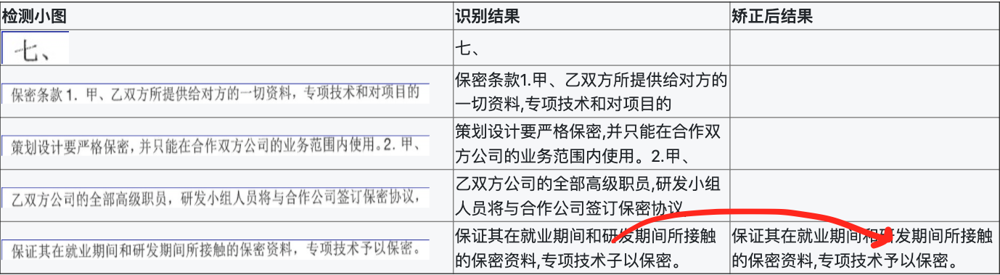
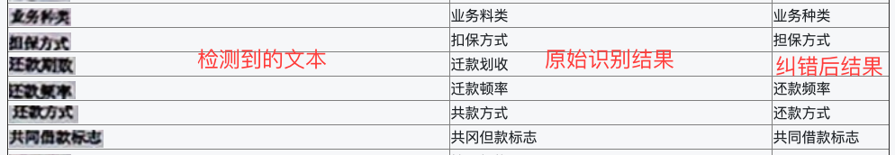

# OCR-Corrector

专为OCR设计的纠错器。

未来考虑增加OCR需要的各种NLP工具，包括：
1. 粘连文本分词
2. 命名实体识别
3. 键值对匹配

# 功能

输入OCR识别结果（文本+单字符置信度），输出修正后的文本。
(单字符置信度：识别网络最后 softmax 输出的概率值，用来进行方便地发现错字。)

## 示例

输入：

```
text = ['我爱北京大安门']
probs = [[0.99, 0.99, 0.99, 0.99, 0.56, 0.99, 0.99]]
```

输出：
```
text_corrected = ['我爱北京天安门']
```

输入：
```
text = ['本着平等、白愿、诚信、互利的原则']
probs = [[0.99, 0.99, 0.99, 0.99, 0.99, 0.78, 0.99, 0.99, 0.99, 0.99, 0.99, 0.99, 0.99, 0.99, 0.99, 0.99]]
```

输出：
```
text_corrected = ['本着平等、自愿、诚信、互利的原则']
```


# 细分场景

目前按照业务场景，分别开发了两种纠错器：文档识别纠错器，单据识别纠错器

## 文档识别
文档是指书籍内页拍摄的图片、扫描的合同等有大段文字的图片。

### 纠错效果



## 单据识别
单据是指字段、格式相对固定，有统一模板或者近似统一的图片，比如各种表单、证件、发票等等，主要特点是单据上出现的文本段相对固定。

使用央行征信报告作为示例：

### 纠错效果

（原图质量较差，所以识别错误很多）

# 使用方法

1. clone 项目
```bash
git clone https://github.com/tiantian91091317/OCR-Corrector.git
pip install -r requirements.txt
```

2. 下载模型和数据

1) 下载[预训练好的BERT模型](https://storage.googleapis.com/bert_models/2018_11_03/chinese_L-12_H-768_A-12.zip) 到 corrector/model/pre-trained 目录下

2）下载用于评价字形相似度的 char_meta.txt 放到 corrector/config 目录下
下载地址:https://pan.baidu.com/s/1iqA-GbzzHBBWfWaxe1g_fg  密码:3f11

3. 安装
```bash
python setup.py install
pip install -r requirements
```

## 使用

### 方法一
可以嵌入到OCR识别的代码里面，将识别模型输出的结果输入纠错器。

```python
import ocr_corrector

corrector = ocr_corrector.initial()
ocr_results, recog_probs = my_ocr(img)
ocr_res_corrected = corrector.correct(ocr_results, recog_probs, biz_type)

```

可以通过运行以下命令进行测试：
```bash
# 测试文档识别纠错
python demo.py --img=corrector/data/1.jpg --biz=doc --api=own
# 测试单据识别纠错
python demo.py --img=corrector/data/2.jpg --biz=report --api=own
```

### 方法二
可以调用识别API后进行后处理。目前支持[阿里高精版识别接口](https://market.aliyun.com/products/57124001/cmapi028554.html?spm=5176.200117.0.0.4f57261aiZhbVd&innerSource=search#sku=yuncode2255400000)的调用。<br>
需要先申请 app code（可以开通免费试用）；然后在 ```corrector/api_call/ali_ocr.py``` 中更新app code：

```python
url = 'https://ocrapi-advanced.taobao.com/ocrservice/advanced'
post_data = {"img":img,
             "prob":True,
             "charInfo":True
             }
app_code = your_app_code
```
然后可以传任意图片测试纠错结果：

```bash
python demo.py --img=corrector/data/your_img.jpg --biz=[doc|report|your_type] --api=ali 
```

### 新增单据类型
文档识别的纠错主要利用局部语义信息进行纠错，**无需**特殊配置；<br>
对于单据识别，由于主要基于其关键词表进行纠错，所以需要进行配置：
1. 在 ```corrector/config/config.json``` 中增加新单据类型的配置（以新增保单识别为例）：
```json
{
      "biz_type": "insurance",
      "corrector_type":"keyword",
      "prob_threshold": 0.9,
      "similarity_threshold": 0.6,
      "char_meta_file": "config/char_meta.txt",
      "key_words_file": "config/kwds_insurance.txt"
    }
```
2. 在 ```corrector/config/``` 目录下增加关键词表 ```kwds_insurance.txt```：
```
投保人
被保险人
受益人
险种名称
……
```

# 原理

见文章：
https://zhuanlan.zhihu.com/p/179957371


# 参考项目
1. Faspell https://github.com/iqiyi/FASPell
2. pycorrector https://github.com/shibing624/pycorrector


# 未来计划

1. 将纠错拓展到非汉字的其他字符，比如 日期、证件号码、标点符号等；
2. 形成OCR所需的NLP工具包，包括粘连文本分词、命名实体识别、键值对匹配等等
